# ☕ Dahab Cafe System

**A production-ready Point of Sale (POS) and Kitchen Display System (KDS) designed for modern cafes with gaming zones. Built with Native Android (Jetpack Compose) and Clean Architecture.**

## 🚀 Overview & Real-World Validation
This project was not built in a vacuum. It is a tailored solution developed to address the specific operational challenges of **"Dahab Cafe."**

The system manages standard food/beverage orders while simultaneously handling **Time-Based Billing** for gaming zones (PlayStation, Billiards, Ping Pong). 

**💡 Client-Driven Development:**
This application has undergone several iterations based on direct feedback from the cafe owner and staff. Key features like the **dedicated Shisha Station**, the **Multi-Rate Game Timer**, and the **Cashier/Kitchen Sync** were refined during live testing to ensure smooth daily operations.

## ✨ Key Features

* **📍 Multi-Zone Management:** Distinct logic for different zones (General, Family, Youth, PlayStation, Billiards).
* **⏱️ Smart Game Timer:** Automatically calculates costs based on duration (Hourly Rate) or fixed matches (Match Rate), as requested by the client.
* **👨‍🍳 Real-Time Kitchen Display (KDS):** Chefs view food/drink orders instantly.
* **💨 Dedicated Shisha Station:** A specialized screen (requested during testing) that isolates Shisha orders from the main kitchen to streamline workflow.
* **🛒 Seamless POS:** Fast order entry, table management, and receipt calculation.
* **⚙️ Admin Control Panel:** Full control over the menu, pricing, tax/service rates, and table configurations.
* **🌍 Localization & Theming:** Full support for Arabic/English and Light/Dark modes.

## 📸 Screenshots

|  ||  |
|:---:|:---:|:---:|
| 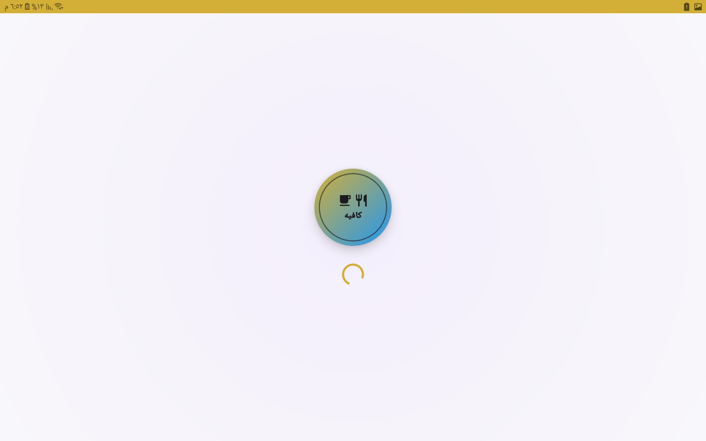 | 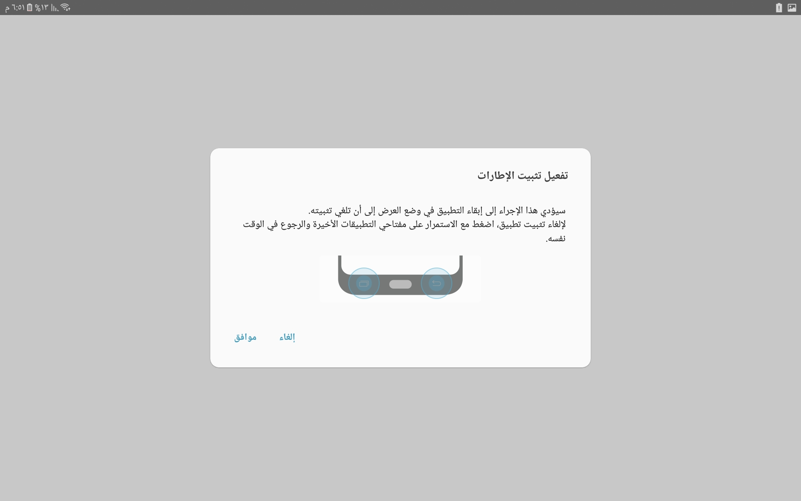 | 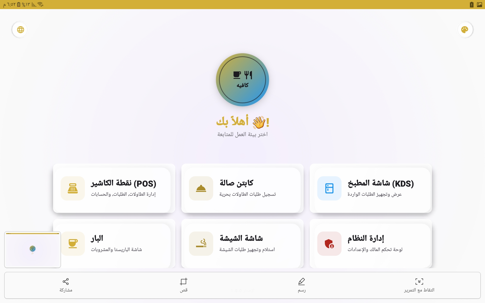 |
| 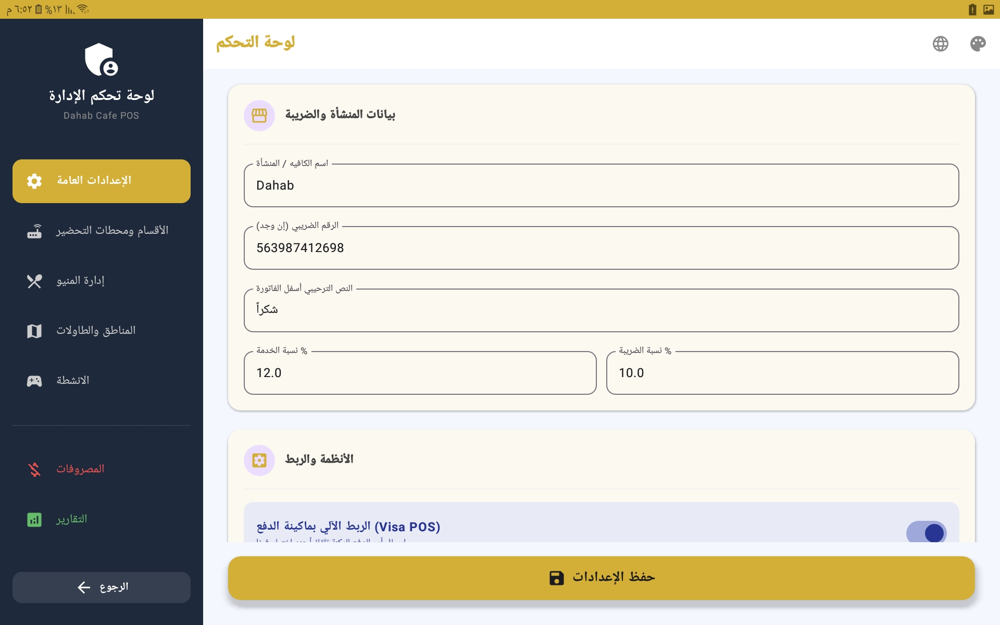 | 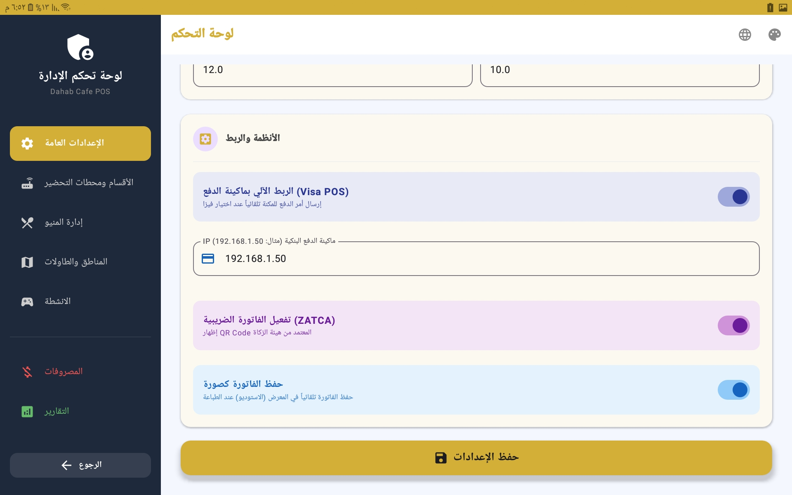 | 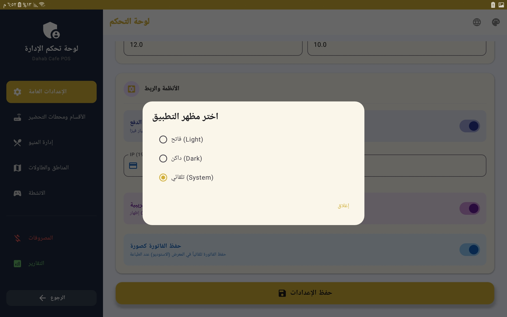 |
| 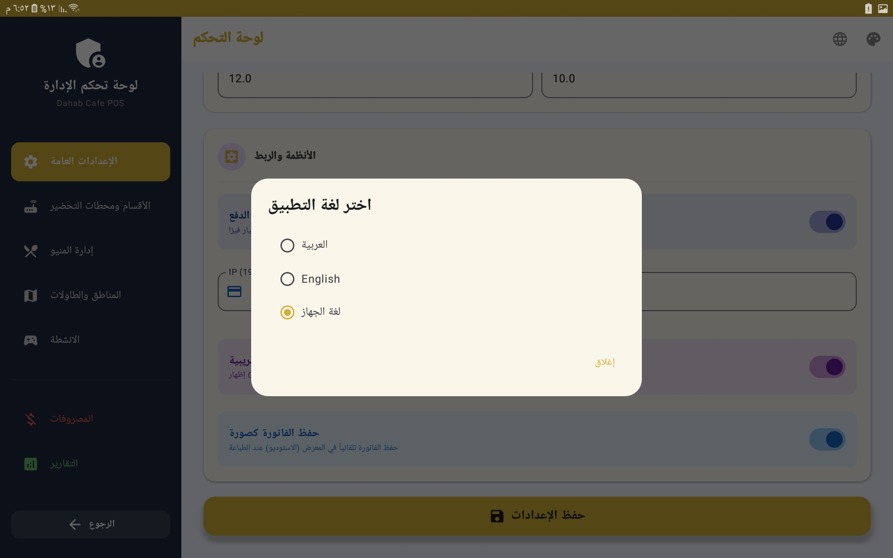 | 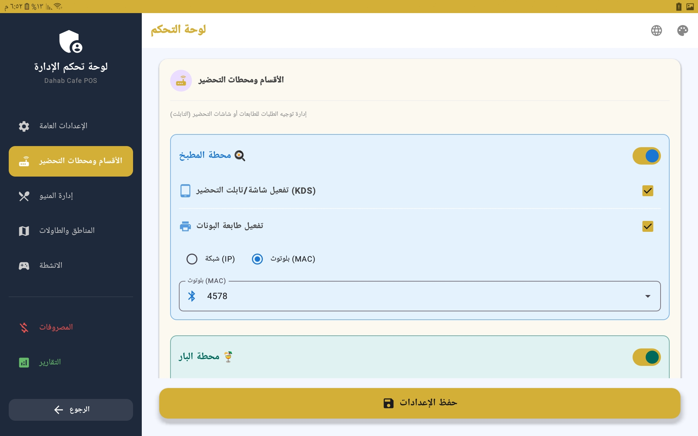 | 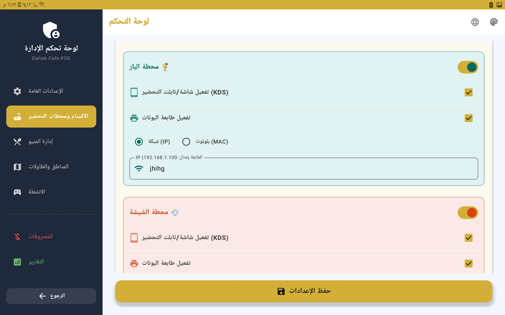 |

|  |  |  |
|:---:|:---:|:---:|
| 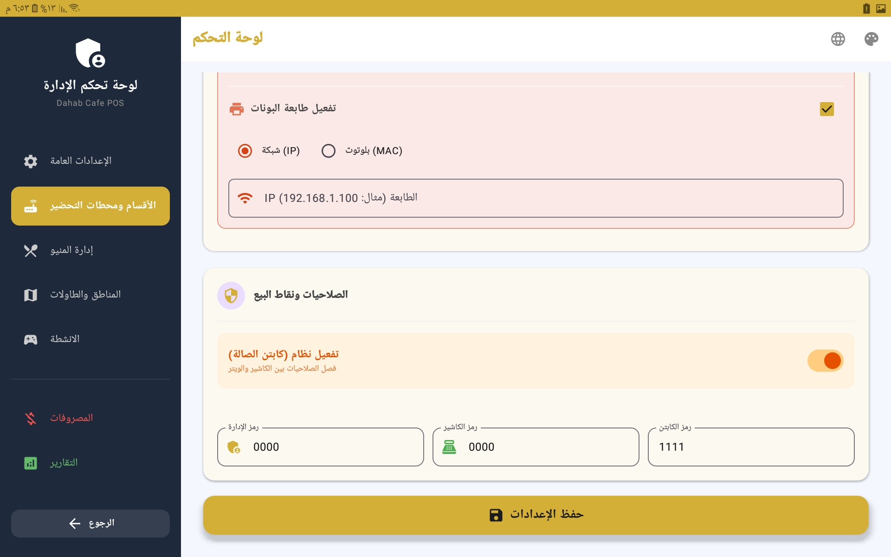 | 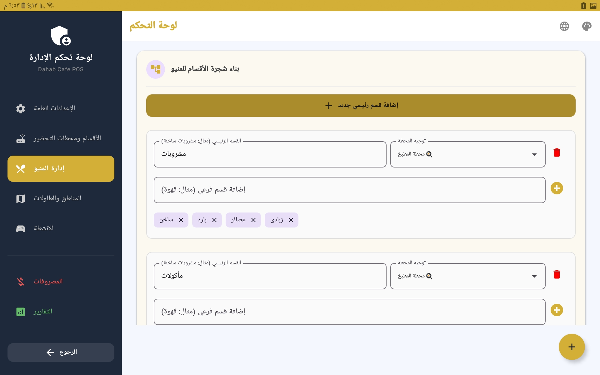 | 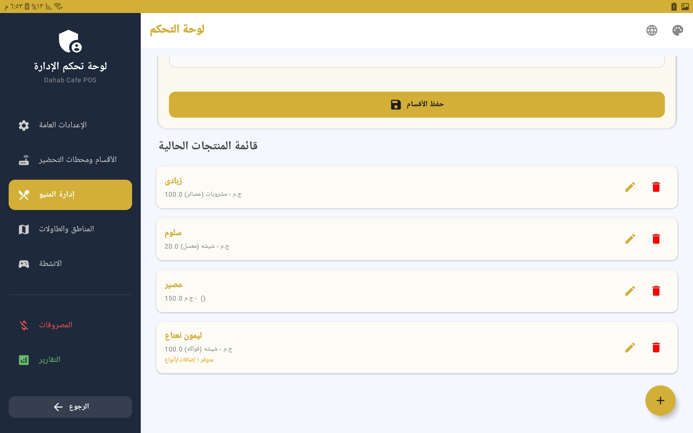 |
| 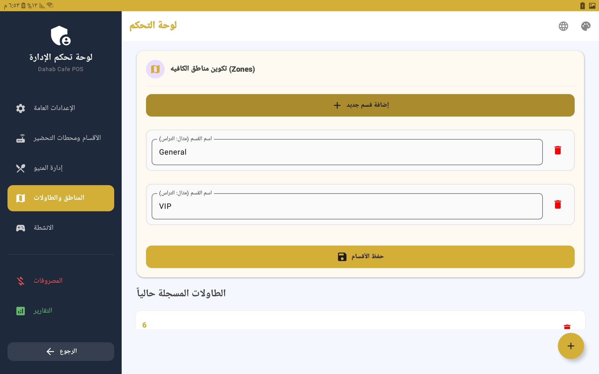 | 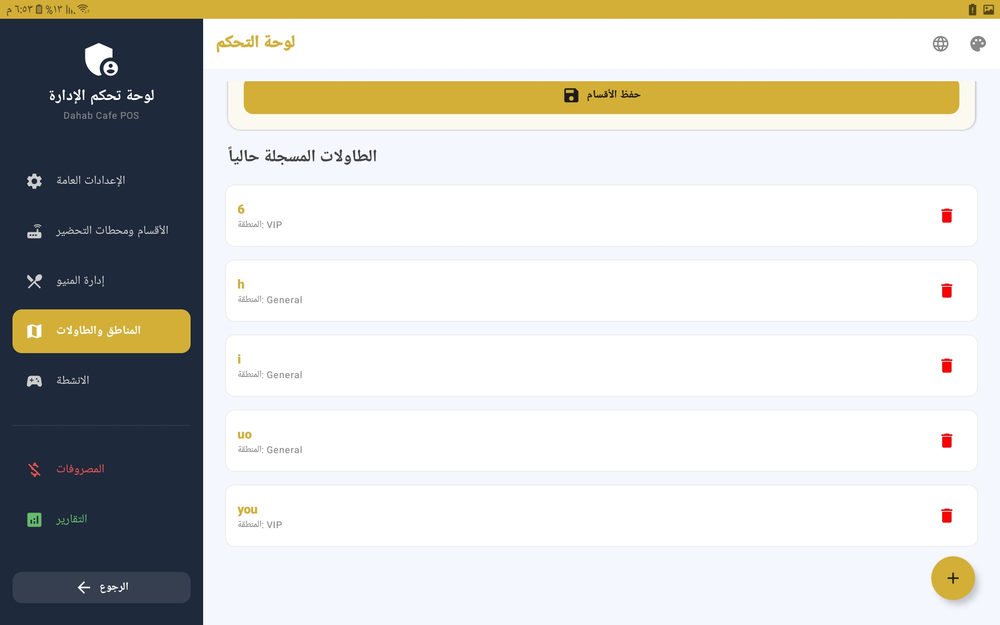 | 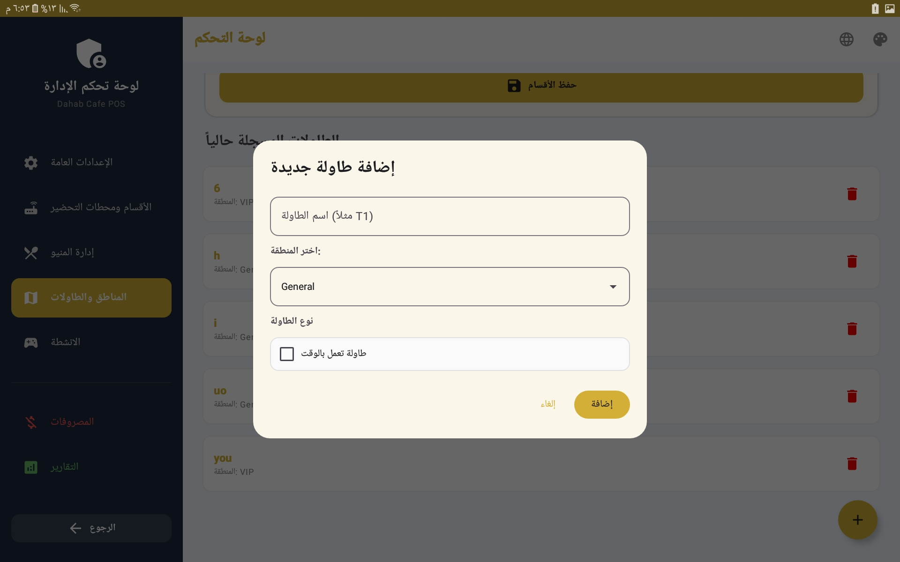 |
| 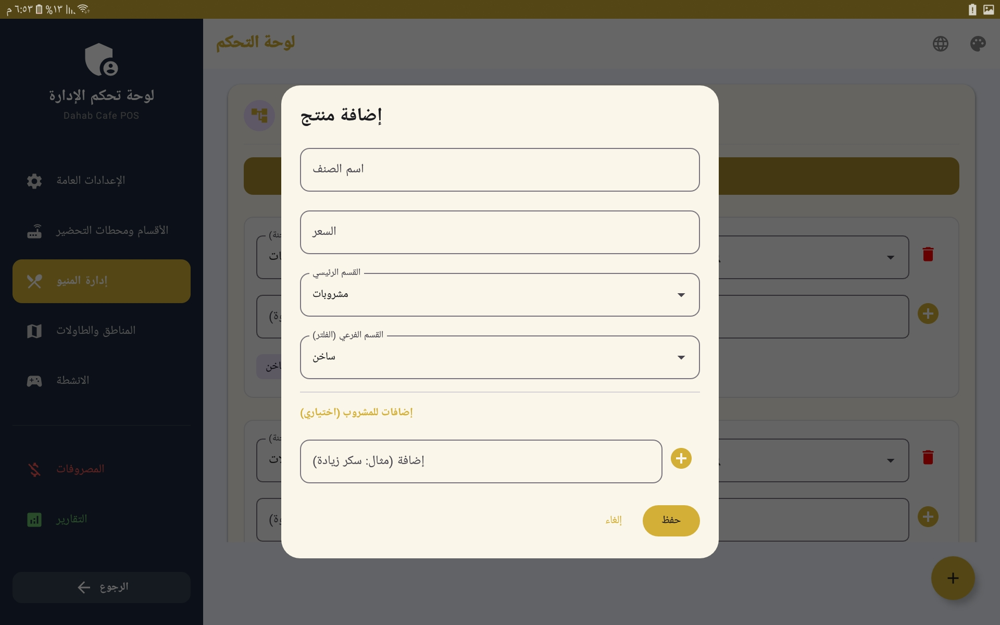 | | |

## 🛠️ Tech Stack & Architecture

The project adheres to **Modern Android Development (MAD)** standards to ensure stability, scalability, and ease of maintenance.

### 🏗️ Architecture
We utilized **Clean Architecture** with the **MVVM (Model-View-ViewModel)** pattern:
* **Presentation Layer:** (Jetpack Compose, ViewModels) - Handles UI state and user interactions.
* **Domain Layer:** (UseCases, Entities) - Contains pure business logic (e.g., calculating game time costs).
* **Data Layer:** (Repositories, Room DB, Data Sources) - Manages data persistence and retrieval.

### 🚀 Libraries & Tools

| Technology | Purpose |
| :--- | :--- |
| **Kotlin** | Primary language. |
| **Jetpack Compose** | Modern, declarative UI toolkit. |
| **Hilt (Dagger)** | Dependency Injection for decoupling components. |
| **Room Database** | Offline-first local data persistence. |
| **Coroutines & Flow** | Asynchronous programming and reactive data streams. |
| **Navigation Compose** | Handling in-app navigation. |
| **ViewModel** | State management and configuration survival. |

## 🔄 Data Lifecycle & Synchronization

1.  **Action:** The Cashier adds an order via the UI.
2.  **Logic:** The ViewModel triggers a UseCase.
3.  **Persistence:** The Repository saves the data to the Room Database.
4.  **Real-Time Sync:** Room emits a `Flow` update.
5.  **Observation:** The **Kitchen Screen** and **Shisha Screen** observe this Flow. They automatically update to show the new order immediately without refreshing.

## 👤 Contact

**[Eslam Ali Atta Rezq]** - Android Developer
* Email: [eslameng776@gmail.com]

---
*Developed with passion to solve real business problems.* 🚀****
