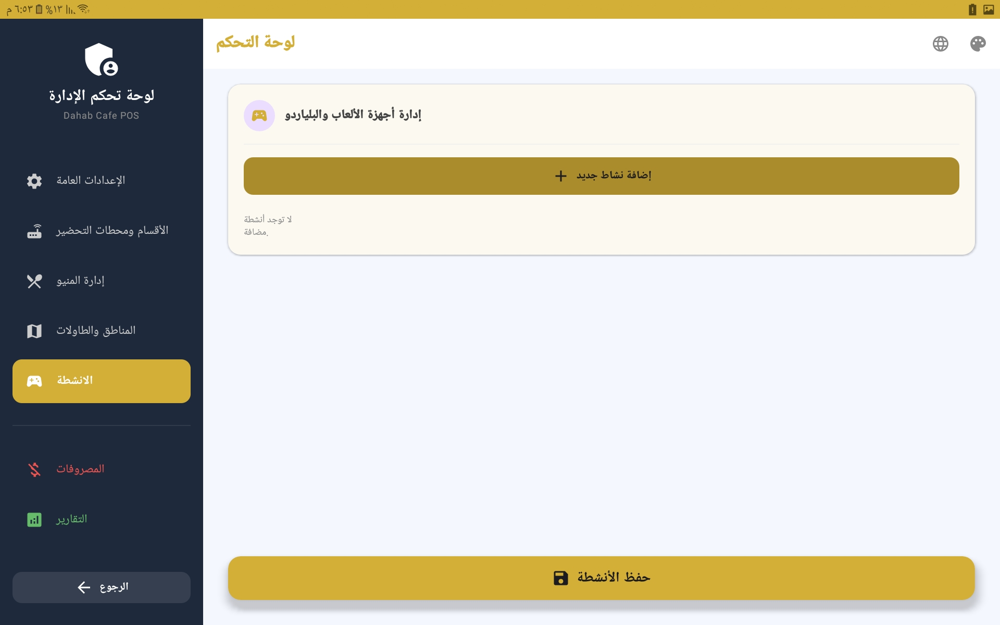
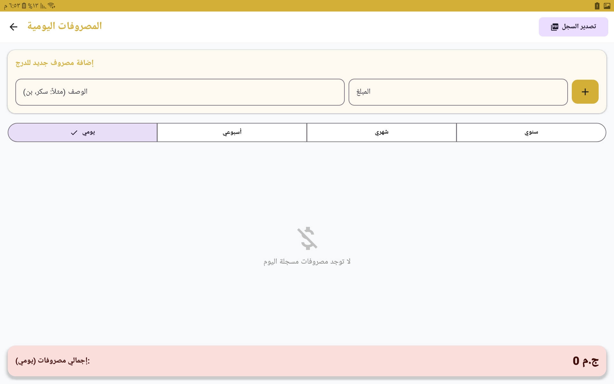

# ☕  Cafe System (POS & KDS)

**A production-ready Point of Sale (POS) and Kitchen Display System (KDS) designed for modern cafes, restaurants, and entertainment lounges.** Built from the ground up using **Native Android (Jetpack Compose)** and **Clean Architecture**, this system acts as a complete, scalable solution capable of standalone operations or SaaS-based deployment.

---

## 🚀 The Story & Real-World Validation
This project was not built in a vacuum. It is a tailored, battle-tested solution developed initially to address the specific operational challenges of **"Dahab Cafe"**.

The system seamlessly merges standard food and beverage ordering with **Dynamic Time-Based Billing** for gaming zones (e.g., PlayStation, Billiards, Ping Pong). 

**💡 Client-Driven Evolution:**
Throughout the development cycle, features were refined based on real-time feedback from cafe owners and staff. Key operational features like the **Isolated Shisha Station**, the **Multi-Rate Game Timer**, **Offline-first Sync**, and **ZATCA E-Invoicing** were implemented to ensure flawless daily operations.

---

## ✨ Core Features & Modules

### 📍 Multi-Zone & Table Management
* **Distinct Zones:** Supports unlimited custom zones (General, Family, VIP, PlayStation, Billiards).
* **Table States:** Real-time visual indicators for table status (Available, Occupied, Pending, Prepared).
* **Merge & Move:** Effortlessly move customers or merge invoices across tables.

### ⏱️ Smart Entertainment Timer
* **Dual Billing Modes:** Automatically calculates costs based on either **Duration** (Hourly Rate) or **Fixed Rounds** (Match Rate).
* **Live Ticketing:** Timers run persistently and update pricing dynamically in real-time.

### 👨‍🍳 KDS (Kitchen Display System)
* **Real-Time Sync:** Instant updates on the kitchen screen the moment an order is confirmed.
* **Status Tracking:** Chefs can transition items through states (New ➔ Waiting ➔ Preparing ➔ Ready).
* **Order Separation:** Specific views for the Kitchen and a dedicated isolated screen for the **Shisha Station** to streamline cafe workflow.

### 🛒 Cashier & POS
* **Draft Mode (Smart Editing):** Cashiers can edit, add, or remove quantities while an order is pending. Changes sync to the kitchen only upon confirmation.
* **Auto-Calculation:** Instant calculation of Subtotal, Service fees, and Taxes based on Admin settings.
* **Hardware Integration:** Seamless Bluetooth thermal printing integration.

### 🧾 ZATCA Approved E-Invoicing
* Fully compliant with Saudi Arabia's ZATCA Phase 1 regulations.
* Generates a Base64 encoded TLV (Tag-Length-Value) QR Code containing the Cafe Name, VAT Number, Timestamp, Total, and Tax amount.
* High-res Dynamic Receipt generation saved locally to the device.

### ⚙️ Dynamic Admin Control Panel
* **Menu Engineering:** Manage categories, products, prices, and kitchen routing.
* **Facility Settings:** Control Service/Tax percentages, VAT numbers, and security PINs.
* **Security:** Role-based access control protecting Admin and Cashier interfaces with custom PIN codes.

### 🌍 Localization & Theming
* Instant, runtime switching between **Arabic/English**.
* Full **Light/Dark mode** support, reacting instantly to user preference or system defaults without application restarts.

---

## 📸 System Showcase

| | | |
|:---:|:---:|:---:|
|  |  |  |
|  |  |  |
|  |  |  |
|  |  |  |
|  |  |  |
|  |  |  |
|  |

---

## 🛠️ Tech Stack & Architecture

Built adhering to **Modern Android Development (MAD)** standards, ensuring high performance, scalability, and ease of future customization.

### 🏗️ Architecture
* **Clean Architecture** combined with the **MVVM (Model-View-ViewModel)** pattern.
* **Presentation Layer:** Jetpack Compose (Declarative UI), ViewModels.
* **Domain Layer:** UseCases, Entities (Pure Kotlin Business Logic).
* **Data Layer:** Repositories, Room Database, Firebase.

### 🚀 Libraries & Tools

| Technology | Purpose |
| :--- | :--- |
| **Kotlin** | Primary programming language. |
| **Jetpack Compose** | Reactive and modern UI toolkit. |
| **Hilt (Dagger)** | Dependency Injection for scalable component management. |
| **Room Database** | Offline-first local data persistence. |
| **Firebase Firestore** | Real-time cloud database synchronization. |
| **Coroutines & StateFlow** | Asynchronous programming and reactive UI states. |
| **Navigation Compose** | In-app routing and backstack management. |
| **ZXing** | Dynamic QR Code generation for ZATCA E-Invoicing. |

---

## 🔄 Data Lifecycle & Synchronization

1. **Action:** The Cashier modifies an order (Draft State).
2. **Commit:** Upon submission, the ViewModel triggers a Domain UseCase.
3. **Persistence & Sync:** The Repository updates the local Room DB and syncs the payload to Firebase Firestore.
4. **Real-Time Observation:** The KDS and Shisha screens listen to these Firestore streams and update their UI instantly, enabling a seamless kitchen workflow without manual refreshing.

---

## 🤝 White-Label & Commercial Use
This system architecture is heavily decoupled, making it extremely easy to **White-Label** for multiple clients. 
* Operates effectively on Firebase's free tier for individual cafes.
* Hidden SaaS modules (Authentication, Subscriptions) are pre-built and can be toggled on to pivot from a standalone product to a centralized SaaS platform.

## 👤 Contact

**[Eslam Ali Atta Rezq]** - Android Developer
* Email: [eslameng776@gmail.com]

---
*Developed with passion to solve real operational bottlenecks in the hospitality industry.*
